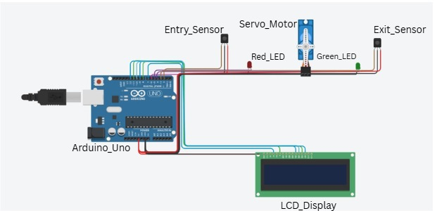
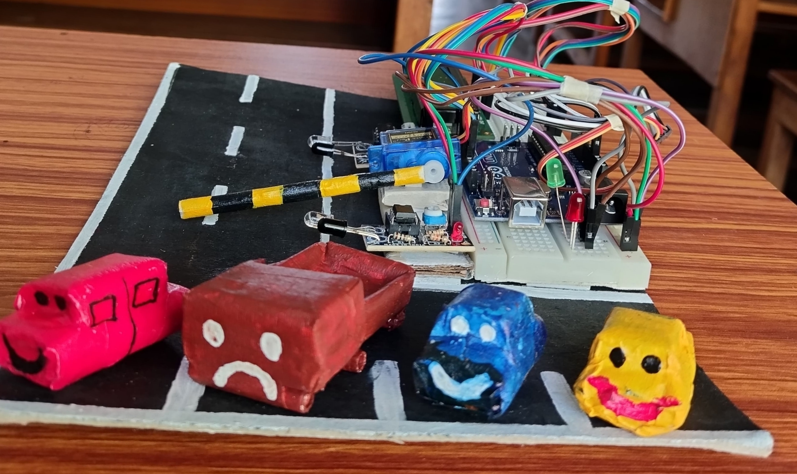
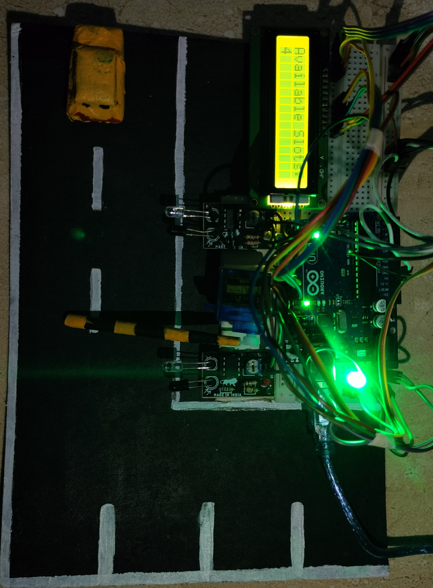
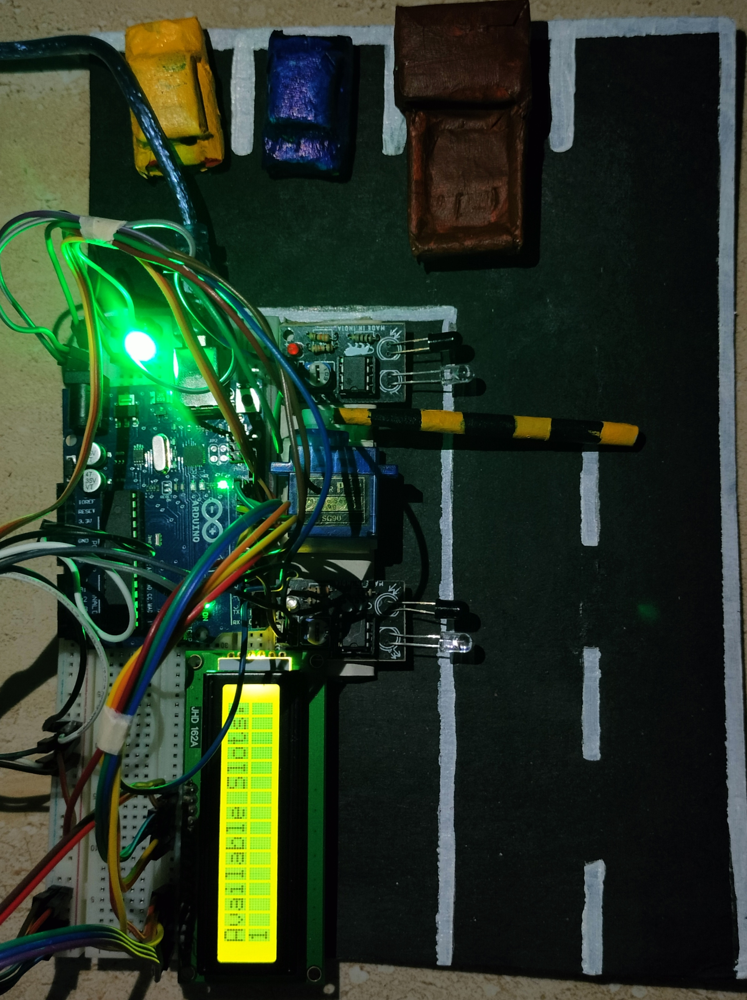
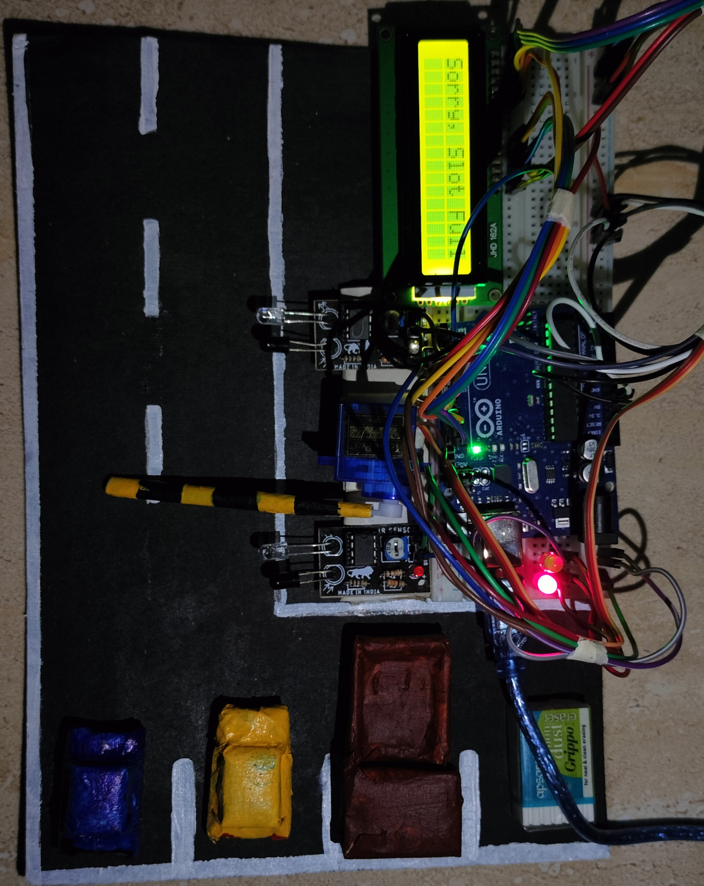

# 🅿️ IoT-Based Smart Parking System

An **IoT-based Smart Parking System** that automates parking slot detection using sensors and microcontrollers. It monitors **real-time slot availability**, controls **entry/exit gates**, and displays **parking status** to reduce congestion and improve efficiency.

---

## 📌 Features

- Real-time parking slot monitoring  
- Automatic gate control  
- User-friendly display of parking availability  
- Reduces traffic congestion  

---

## 🧭 Circuit Diagram

  
*Circuit diagram of the smart parking system.*

---
## 🔧 Hardware Setup

  
*Top view of the hardware prototype.*

  
*Front view of the hardware prototype.*

---

## 📊 Slot Availability Conditions

### ✅ All Slots Available
  
*Display showing all parking slots are available.*

### ⚠️ One Slot Left
  
*Display indicating only one parking slot is left.*

### ❌ Slot Full
  
*Display indicating all parking slots are occupied.*

---

## 🗂️ Repository Structure

- **images/** – Hardware images and slot displays  
  - `hardware_top.jpg` – Top view of the hardware  
  - `hardware_front.jpg` – Front view of the hardware  
  - `all_slots_available.jpg` – Display showing all slots available  
  - `slot_1_left.jpg` – Display showing one slot left  
  - `slot_full.jpg` – Display showing all slots full  

- **circuit_diagram.jpg** – Circuit diagram of the smart parking system  
- **smart_parking_system.ino** – Main Arduino code for the smart parking system  
- **README.md** – Project documentation  

---

## 🚀 How It Works

1. Sensors detect the presence of vehicles in each slot.  
2. Microcontroller updates the slot availability on the display in real-time.  
3. Gates are automatically controlled based on availability.  
4. Alerts indicate when parking is full or nearly full.  

---

## ⚙️ Setup & Usage

Follow these steps to download and run the Smart Parking System on your Arduino:

1. **Download the Repository**
   - Click the green **Code** button on the top right of the repository.  
   - Select **Download ZIP** and save it to your computer.  
   - Alternatively, clone the repository using Git:
     ```bash
     git clone https://github.com/MonalisaSahu24/smart-parking-system.git
     ```

2. **Open the Arduino Code**
   - Locate the file `smart_parking_system.ino` in the downloaded folder.  
   - Open it using the [Arduino IDE](https://www.arduino.cc/en/software).

3. **Connect the Hardware**
   - Connect your microcontroller (e.g., Arduino Uno) and sensors as per the circuit diagram (`circuit_diagram.jpg`).  

4. **Upload the Code**
   - Select the correct board and port in Arduino IDE.  
   - Click **Upload** to flash the code to the Arduino.

5. **Run the System**
   - Power up the hardware.  
   - Monitor real-time parking slot availability and gate control using the display.  

> ⚠️ Make sure all sensors and wiring connections match the circuit diagram to avoid malfunctions.

---

## 👥 Team Members

This project was developed by:
- [Monalisa Sahu](https://github.com/MonalisaSahu24)  
- [Mahima Patnaik](https://github.com/mahima-715)  
- [Krishna Panigrahi](https://github.com/mamuni77k)  

---

## 📬 Contact

For questions or collaborations, feel free to reach out to the team members via their GitHub profiles above.
